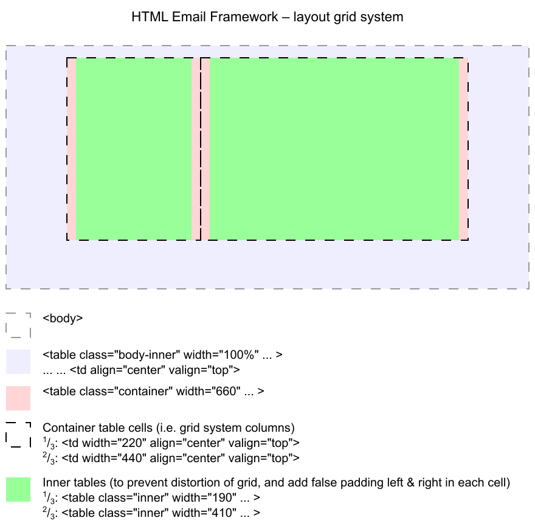

# HTML Email Framework – Docs


## Using table layouts

Tables are necessary for layouts in HTML emails, because (to date) many HTML email recipients can't (fully) handle block position layout, floats, etc.

To make a layout display as a single column on smaller screens media queries can be used. More on this later.

> **Tip:** Use `align="center"` to center your tables, because `margin:auto;` is not understood by some email clients.


## Resets for various email clients

In order the HTML email to look the same (or at least acceptible) in different email clients, I have used a combination of HTML tag attribute resets and CSS resets. Mostly, these have to do with removing and collapsing table borders and cell spacing.

The HTML resets are, of course, within the HTML while the CSS resets are in the `<head>` stylesheet for development purposes (same for the framework CSS that follows). I have started with the template styles in the `<head>` so that there is less clutter in your way when you are building and styling your HTML email.


## The Table based grid system

I have chosen a grid container max width 660px because: 

1. This width looks good on many email and webmail systems and on tablet screens.
2. This width gives a good number of words per line in "full width" blocks.
3. This width is easily divisible by 2 and 3 for use in the grid system.

In order to ensure that these widths are obeyed (you've probably noticed that table column widths auto-adjust depending on the amount of text that they contain), it is necessary to embed your content **within another table** inside each of these grid columns. For all these (whatever span width) I have assigned `class="inner"`. 

(This `class="inner"` is used by the media query to collapse the table layout to a single column "phones layout" on narrow screens. See below.)

Centering these inner tables and controlling their width will enable you to create "false left and right padding" around your content. 

> **Note:** For a **full width image** occupyng the entire width of the container table (660px when not collapsed to "phones layout"), _do not include an inner table_.



| Column number | Column Width       | Inner table width | False padding left & right |
|---------------| -------------------|:-----------------:|:-------------:|
| One column    | Full width = 660px | 630px             | 15px          |
| Two columns   | Half width = 330px | 300px             | 15px          |
| Three columns | One third = 220px  | 190px             | 15px          |
|               | Two thirds = 440px | 410px             | 15px          |


## How to use the grid system

 1. Build the grid layout, section by section* in your email.
 2. Set the table styling, as far as possible, using HTML tag attributes (as a fallback). 
 3. Add your content, and your own styles (first adding `bgcolor=" "` the "old fashioned" way, then add other styles in the `<head>`
 4. Use a **CSS inliner** to bring styles inline before deploying your template.

(* More on layout sections below.)

For example, here is an (outer) grid with a 1/3 column and a 2/3 column:

```html
<table width="660" border="0" cellpadding="0" cellspacing="0" class="container your-class">
	<tbody>
		<tr>
			<td width="220" align="center" valign="top">...</td>
			<td width="440" align="center" valign="top">...</td>
		</tr>
	</tbody>
</table>
```

And here is an example inner table within a one-third width column cell:

```html
...
<td width="220" align="center" valign="top" class="col-220">
	<table class="inner" width="190" border="0" cellpadding="0" cellspacing="0">
		<tbody>
			<tr>
				<td align="center" valign="top">
					Your content in here...
				</td>
			</tr>
		</tbody>
	</table>
</td>
...
```

> **Note:** column nesting, offsets etc. have not been included in this framework.


## Layout Sections

For complex emails it is recommended to divide the content into sections (e.g. header, main section #1 ... main section #N, footer) and place each of these into its own container table.

* This will keep you organized, so that you "know where you are" in your code.
* You can re-use older emails, seeing how to easily swap out older sections for newer.
* If you are developing a template for use in an e-marketing ststem such as [Campaign Monitor](http://www.campaignmonitor.com), you can easily wrap these sections in their bespoke `<layout>` tags in a `<repeater>` block.

## Layout Helpers

I have provided two vertical spacers (10px and 20px), and a dividing line (adds a table cell containing only 1px high "line" colored #dddddd. Other styles are added via CSS.

```html
<tr>
	<td class="vertical-spacer-10" height="10">&nbsp;</td>
</tr>

<tr>
	<td class="vertical-spacer-20" height="20">&nbsp;</td>
</tr>

<tr>
	<td class="vertical-spacer-40" height="40">&nbsp;</td>
</tr>

<tr>
	<td class="dividing-line" height="1" bgcolor="#dddddd">&nbsp;</td>
</tr>

```

> **Tip:** If you use these helpers in a 2 or 3 column module, you may need to add `colspan="2"` or `colspan="3"`.


## Simple buttons

A simple "button effect" can be created by inserting yet another table within the content inner table, and giving it `class="button"`. The other components are as follows:

```html
<tr>
  <td align="center" valign="top">
    <table class="button" width="100%" border="0" cellpadding="0" cellspacing="0">
      <tbody>
        <tr>
          <td align="center">
            <a href="#">Read more &raquo;</a>
          </td>
        </tr>
      </tbody>
    </table>
  </td>
</tr>
```

## "Phones Layout" is accomplished by CSS media query overrides

This responsive framework switches to a single column payout for two size-groups of narrow screens. The smaller single column layout is for 320px width phones (portrait orientation). The larger single column layout is for larger phones (and smaller phones in landscape orientation).

```css
@media only screen and (max-width:680px) {
  table[class=container],
  table[class=inner-wrap] {
    display: block !important;
    width: 480px !important;
    margin: auto !important;
  }
  table[class=container] td {
    width: 480px !important;
    float: left !important;
  }
  table[class=inner-wrap] td {
    width: 450px !important;
    padding: 0 15px !important;
  }
}

@media only screen and (max-width:500px) {
  table[class=container],
  table[class=inner-wrap] {
    width: 320px !important;
  }
  table[class=container] td {
    width: 320px !important;
  }
  table[class=inner-wrap] td {
    width: 290px !important;
  }
}
``` 

Here the table is broken into a single, narrow column. `display: block` overides the default tabular display, and `float: left` is necessary because some older clients persist in displaying these that all clients `display: block`-overridden table cells as side by side within a row.

I have applied this switch to `table` too, in case in your design you choose to display two tables side by side within one outer cell (e.g. `<table align="left">...</table><table>...</table>`). So for narrow screens, these too are one below another in a single column.

> **Note:** `!important` enables these `<head>` stylesheet rules to override the **inline styles**.

If you need to override specific classes, **target the class as a tag attribute selector**. For example:

```css
@media only screen and (max-width:320px) {
	img[class=logo] {
		width: 150px !important;
		height: auto !important;
	}
}
```


### Building your HTML email template

Just do this:

1. After designing your email (e.g. on paper), start copying and renaming one of the example HTML emails included here, rearranging and copy-pasting stuff to suit your requirements.
2. Add your own styles: 
	* First, as far as you can with HTML tag attributes (e.g. `bgcolor="#ff0000"`);
	* Second, with CSS within the `<head>` stylesheet (see note on using classes below).
3. When you are done being creative, copy your CSS into all the HTML tags as appropriate.

> **Note:** Do not use multiple classes within a single HTML tag (e.g. `class="container header"`) because this framework targets classes using **tag attributes** (e.g. `table[class=container]`). If you need more specificity then use a wrapper, e.g.:
> 
> ```html
> <span class="header" ... >
> 	<table class="container" ... >
> 		...
> 	</table>
> </span>
> ```


### Bringing `<head>` styles into your tags

Eventually, all `<head>` CSS (resets, framework plus your own styles) except the media query stuff will need to be converted into inline styles within each HTML element where they are applicable. This is because because some email clients can't read `<head>` stylesheets (and some clients strip away the email `<head>` and `<body>` tags).

> **Tip:** use a **CSS inliner** to bring styles inline before deploying your template. Example: [Premailer](http://premailer.dialect.ca).
